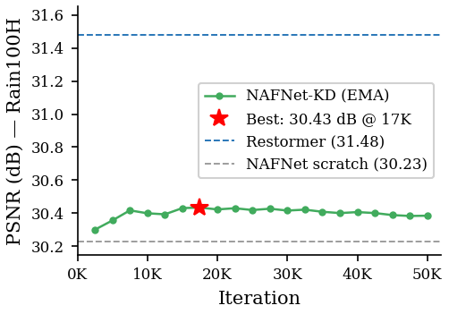
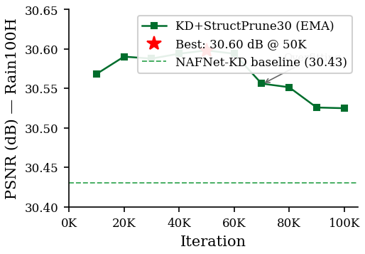
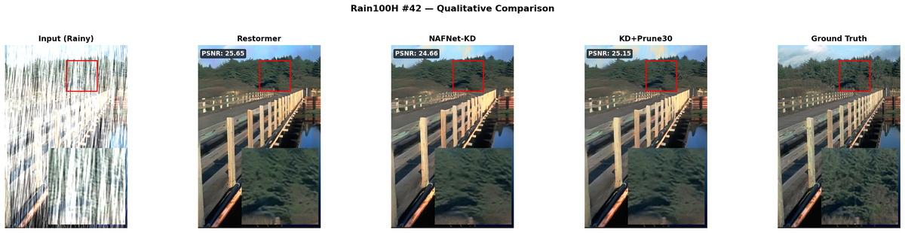
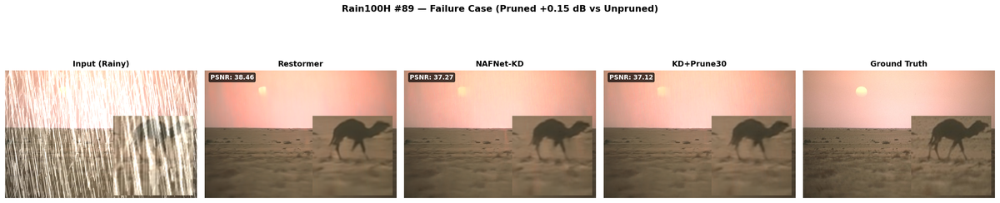

# Image Deraining Model Compression

Systematic study of model compression techniques for image deraining, comparing quality-efficiency tradeoffs across knowledge distillation, structured pruning, quantization, and ONNX deployment.

## Compression Pipeline

```
Restormer FP32 (teacher)
  31.48 dB | 26.13M params | 154.9 GMACs | 104.7 MB | 46.4 ms
                |
                | Knowledge Distillation
                v
NAFNet-KD FP32
  30.43 dB | 29.16M | 16.1 GMACs | 116.9 MB | 11.3 ms
  [-1.05 dB, 9.6x fewer GMACs, 4.1x lower latency]
                |
                | Structural Pruning (DepGraph, 30%)
                v
NAFNet-KD-Pruned FP32
  30.60 dB | 20.13M | 12.2 GMACs | 80.8 MB | 11.2 ms
  [+0.17 dB*, 1.45x fewer params, 1.32x fewer GMACs]
                |
                | FP16 (autocast) + ONNX Runtime
                v
Deployed model
  30.60 dB | 20.13M | 12.2 GMACs | 40.5 MB (FP16) | 9.0 ms (ORT)
  [2x size reduction, 1.24x latency reduction]
```

\*Apparent PSNR gain from additional training iterations, not from pruning itself.

## Results

### Baseline Models

| Model | Architecture | PSNR (Rain100H) | Params | GMACs | Latency |
|-------|-------------|-----------------|--------|-------|---------|
| [Restormer](https://arxiv.org/abs/2111.09881) | Transposed attention | 31.48 dB | 26.13M | 154.9 | 46.4 ms |
| [DRSformer](https://arxiv.org/abs/2307.05915) | Sparse attention | 33.87 dB | 33.66M | 243.0 | 109.2 ms |
| [NAFNet-w32](https://arxiv.org/abs/2204.04676) | SimpleGate CNN | 30.23 dB | 29.16M | 16.1 | 11.2 ms |

### Full Pipeline Waterfall

| Stage | PSNR-H | PSNR-L | Params | GMACs | Size | Latency |
|-------|--------|--------|--------|-------|------|---------|
| Restormer FP32 (teacher) | 31.48 | 39.15 | 26.13M | 154.9 | 104.7 MB | 46.4 ms |
| NAFNet-KD FP32 | 30.43 | 37.32 | 29.16M | 16.1 | 116.9 MB | 11.3 ms |
| + StructPrune30 FP32 | 30.60 | 37.45 | 20.13M | 12.2 | 80.8 MB | 11.2 ms |
| + FP16 (autocast) | 30.60 | 37.45 | 20.13M | 12.2 | 40.5 MB | 12.6 ms |
| + ONNX Runtime GPU | 30.60 | — | 20.13M | 12.2 | 81.2 MB | 9.0 ms |

**Cumulative compression:** -0.88 dB quality, 12.7x fewer GMACs, 5.2x lower latency.

### Training Curves

<p align="center">


</p>

*Left:* KD training peaks at 30.43 dB by 17.5K iterations. *Right:* Pruning fine-tuning peaks at 30.60 dB by 50K, with mild overfitting thereafter.

### Qualitative Comparison

<p align="center">

</p>

Input (rainy) | Restormer | NAFNet-KD | KD+Prune30 | Ground Truth. The pruned model output is visually indistinguishable from the unpruned student and close to the teacher.

<p align="center">

</p>

Worst-case pruning degradation across all 100 Rain100H images: only 0.15 dB.

## Key Findings

1. **Knowledge distillation is the highest-value technique.** KD compresses 154.9 GMACs to 16.1 GMACs (9.6x) at only 1.05 dB quality loss. No other technique matches this ratio.

2. **Structural pruning works where unstructured pruning fails.** Unstructured pruning with `prune.remove()` achieves zero real compression (weights regrow during fine-tuning). torch-pruning's DepGraph physically removes channels, yielding 1.45x parameter reduction with no quality loss.

3. **NAFNet's U-Net topology limits pruning reach.** Skip connections, PixelShuffle, and strided convolutions lock backbone widths. Only internal expansion convolutions within NAFBlocks can be pruned.

4. **FP16 is always worth applying.** <0.01 dB quality loss, 2x size reduction, no GPU latency penalty. Requires `torch.autocast` (pure `model.half()` degrades quality).

5. **INT8 is architecture-dependent.** Static INT8 drops Restormer by 2.0 dB but NAFNet by only 0.8 dB. Softmax attention is poorly suited to 8-bit representation.

6. **ONNX Runtime helps CNNs, hurts transformers.** NAFNet gets 1.24x GPU speedup. Restormer and DRSformer get slower due to unoptimized attention kernels.

## Experiments

| Directory | Technique | Status |
|-----------|-----------|--------|
| [`experiments/distillation/`](experiments/distillation/) | Restormer-to-NAFNet knowledge distillation | Complete |
| [`experiments/pruning/`](experiments/pruning/) | Unstructured pruning (v1, buggy) | Abandoned |
| [`experiments/pruning_v2/`](experiments/pruning_v2/) | Manual width reduction to NAFNet-w22 | Complete |
| [`experiments/pruning_v3/`](experiments/pruning_v3/) | Structural pruning via torch-pruning DepGraph | Complete |
| [`experiments/quantization/`](experiments/quantization/) | FP16 / INT8 post-training quantization | Complete |
| [`experiments/deployment/`](experiments/deployment/) | ONNX export and ORT benchmarking | Complete |

## Repository Structure

```
deraining/
├── configs/                    # Training configs (NAFNet YAML)
├── datasets/                   # Rain13K train/test (not tracked)
├── evaluation/                 # Unified eval pipeline (metrics, efficiency, wrappers)
├── experiments/
│   ├── distillation/           # KD: Restormer -> NAFNet
│   ├── pruning/                # v1: unstructured (abandoned)
│   ├── pruning_v2/             # v2: manual width reduction
│   ├── pruning_v3/             # v3: structural (torch-pruning DepGraph)
│   ├── quantization/           # PTQ: FP16 / INT8
│   ├── deployment/             # ONNX export + ORT benchmarks
│   └── pareto_plot.py          # Pareto frontier plots
├── models/                     # Cloned repos: Restormer, NAFNet, DRSformer (not tracked)
├── pretrained/                 # Model weights (not tracked, see Setup)
├── results/
│   ├── baselines/tables/*.csv  # All result CSVs
│   └── figures/                # Key figures for README
├── scripts/                    # Shell scripts (train, eval, download)
├── REPORT.md                   # Detailed final report
└── requirements.txt
```

## Setup

```bash
conda create -n deraining python=3.10
conda activate deraining
pip install -r requirements.txt

# Clone model repos
git clone https://github.com/swz30/Restormer.git models/Restormer
git clone https://github.com/megvii-research/NAFNet.git models/NAFNet
git clone https://github.com/cschenxiang/DRSformer.git models/DRSformer

# Download datasets
bash scripts/download_datasets.sh

# Download pretrained weights to pretrained/
# restormer_deraining.pth, drsformer_deraining.pth, nafnet_w32_kd.pth
```

## Reproduction

```bash
# Run full compression pipeline
python experiments/distillation/distill_restormer_to_nafnet.py
python experiments/pruning_v3/structured_pruning_physical.py --phase prune
python experiments/pruning_v3/structured_pruning_physical.py --phase finetune \
    --pruned_ckpt experiments/pruning_v3/checkpoints/nafnet_kd_structpruned30_raw.pth
python experiments/pruning_v3/structured_pruning_physical.py --phase eval \
    --checkpoint experiments/pruning_v3/checkpoints/nafnet_kd_structpruned30_best.pth

# Post-training evaluation (FP16, ONNX export, ORT benchmark)
python experiments/pruning_v3/eval_full_pipeline.py

# Evaluate all baselines
bash scripts/eval_all.sh
```

## Hardware

- GPU: NVIDIA RTX PRO 4500 Blackwell (33.7 GB VRAM)
- CUDA 13.1, PyTorch 2.11.0+cu128, torch-pruning 1.6.0
- All latency measurements at 1x3x256x256 resolution
